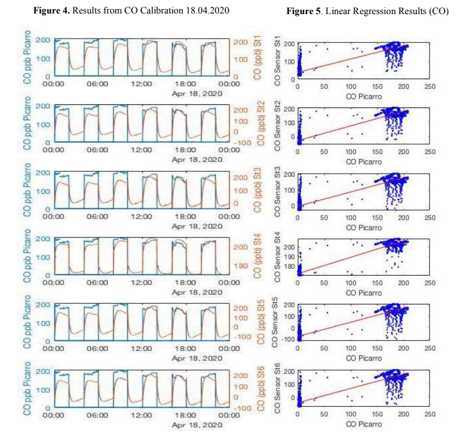
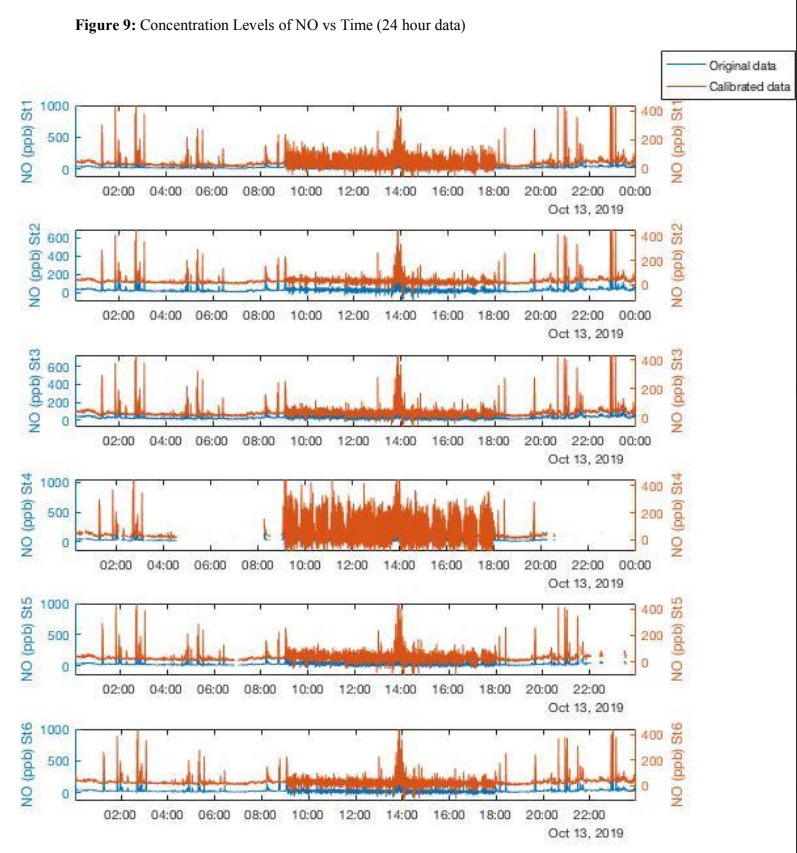
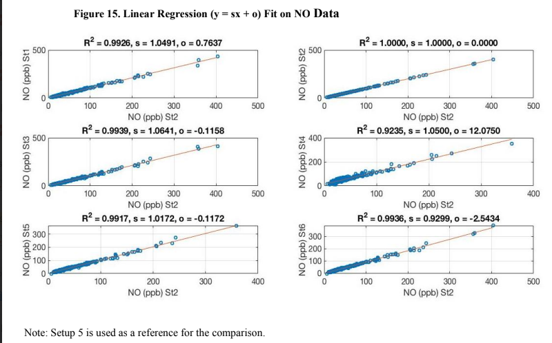

# Figures

Selected results from the MSc thesis analysis of electrochemical sensors for airborne air-quality measurements.

## CO sensor calibration

*CO-B4 sensor calibration against Picarro reference measurements, together with the corresponding linear regression results.*

A transient response was observed following changes in humidity, after which the sensor measurements gradually stabilized.

## NO concentration time series

*Twenty-four-hour NO concentration measurements from the six sensor setups during the Zeppelin field campaign.*

Setups 1 and 4 showed greater variability than the other setups, consistent with the increased noise observed during the analysis.

## NO inter-sensor comparison

*Linear regression comparing NO measurements between the six sensor setups.*

The measurements were averaged to one-minute intervals before comparison, with Setup 5 used as the reference.
